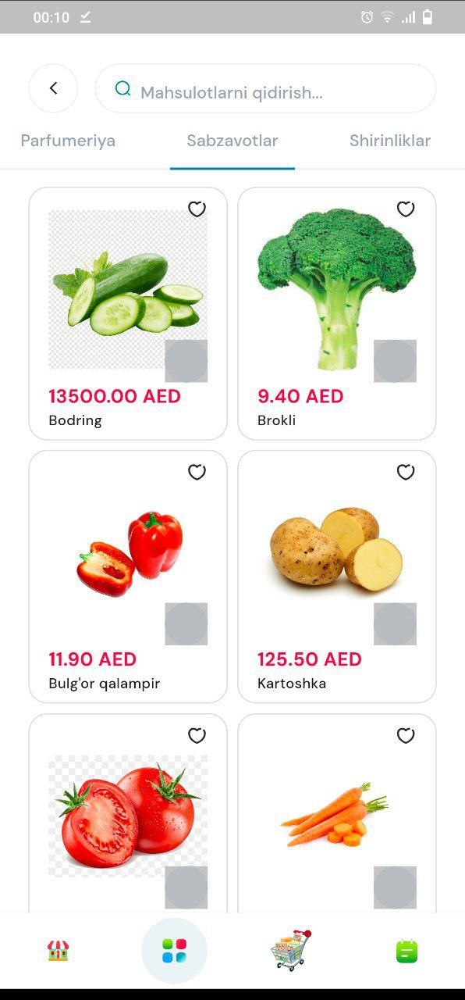
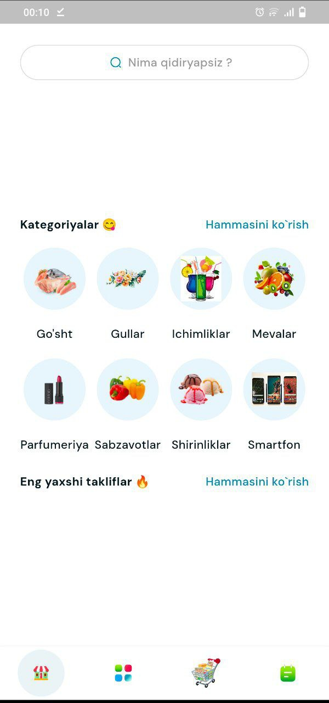
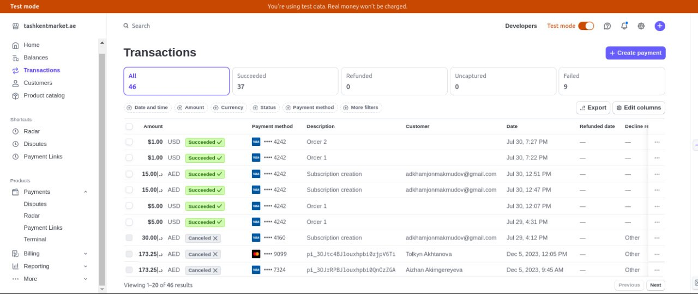

# Tashkent Market API

Backend API for the Tashkent Market platform, built with Django and Django REST Framework.

## Project Description

`tashkentmarket.ae` is a production-focused digital ordering platform built for an Uzbek restaurant business in the UAE.  
This backend powers the restaurant's mobile app and internal admin workflows, helping customers discover products, place orders, and complete online payments while superadmins receive real-time operational updates.

The system is designed to support:
- fast food ordering experience for UAE-based Uzbek cuisine customers
- centralized catalog and order management for restaurant operations
- secure payment flow using Stripe checkout
- automated webhook-based payment status synchronization
- Telegram notifications for superadmins when new orders are created

It provides:
- user authentication by phone number
- product and category management
- order creation and history
- Stripe checkout integration
- Telegram order notifications
- landing page content APIs (news, offers, social links, recalls, about)
- admin panel with Jazzmin

## Tech Stack

- Python
- Django
- Django REST Framework
- Stripe
- Celery + Redis
- Aiogram (Telegram bot)
- drf-yasg (Swagger UI)

## Project Structure

- `config/` - Django project settings, URL config, WSGI/ASGI, Celery config
- `apps/orders/` - products, categories, orders, payment/webhook flow
- `apps/users/` - custom user model, register/login endpoints
- `apps/landing/` - landing page CMS-like content endpoints
- `templates/` - payment success/fail and admin template overrides
- `apps/static/` - admin and frontend static assets

## Requirements

- Python 3.10+ recommended
- `pip`
- Redis (required for cache and Celery broker/backend)

## Installation

1. Clone the repository
2. Create and activate virtual environment
3. Install dependencies
4. Configure `.env`
5. Run migrations
6. Start server

```bash
git clone <your-repo-url>
cd Tashkent-Market-API
python -m venv venv
source venv/bin/activate
pip install -r requirements.txt
python manage.py migrate
python manage.py runserver
```

## Environment Variables

Create a `.env` file in project root.

```env
DJANGO_SECRET_KEY=change-me
DJANGO_DEBUG=True
DJANGO_ALLOWED_HOSTS=localhost,127.0.0.1

SITE_URL=http://127.0.0.1:8000
REDIS_CACHE_URL=redis://127.0.0.1:6379/1
CELERY_BROKER_URL=redis://localhost:6379/0
CELERY_RESULT_BACKEND=redis://localhost:6379/0

STRIPE_SECRET_KEY=
STRIPE_PUBLISHABLE_KEY=
STRIPE_WEBHOOK_SECRET=

TELEGRAM_BOT_TOKEN=
TELEGRAM_GROUP_CHAT_ID=
TELEGRAM_USER_CHAT_ID=
```

## Running Celery

Run worker:

```bash
celery -A config worker -l info
```

## API Documentation

Swagger UI is available at:

- `GET /`

Main API prefix:

- `GET|POST /api/...`

## Main Endpoints

### Authentication

- `POST /api/auth/register/` - register with phone and password
- `POST /api/auth/login/` - login and get token
- `GET /api/auth/user/<id>/` - get user details

### Orders and Products

- `GET /api/categories/`
- `GET /api/all_categories/`
- `GET /api/products/`
- `GET /api/best_products/`
- `POST /api/orders/` - create order
- `GET /api/order-history/`
- `GET /api/order-history/users/<user_id>/`
- `POST /api/import-products/` - Excel import
- `POST /api/import-categories/` - Excel import
- `POST /api/webhook/` - Stripe webhook

### Landing

- `GET /api/special-offers/`
- `GET /api/news/`
- `GET /api/companies/`
- `GET /api/social-networks/`
- `GET /api/recalls/`
- `GET /api/aboutus/`

## Authentication

The API uses DRF Token authentication.

Use header:

```http
Authorization: Token <your_token>
```

## Stripe Integration Notes

- Checkout sessions are created from order items
- Stripe webhook endpoint updates payment/order status
- Make sure webhook secret in `.env` matches your Stripe webhook configuration

## Telegram Notifications

Order notifications are sent via Telegram bot:
- group message to `TELEGRAM_GROUP_CHAT_ID`
- optional direct message to `TELEGRAM_USER_CHAT_ID`

## Product Samples

### 1) Mobile Application Experience

The backend APIs in this repository are used by the restaurant's mobile application for browsing categories/products and creating orders.




### 2) Stripe Payment Integration

Stripe checkout is integrated so customers can complete card payments securely from the app flow.



### 3) Stripe Webhook + Order Status Sync

After payment events are sent by Stripe, the webhook endpoint (`/api/webhook/`) updates payment and order statuses in the backend automatically.

This ensures:
- successful payments are reflected in order status
- failed/canceled/expired payments are handled consistently
- admin-side operations always see synchronized payment state

### 4) Telegram Superadmin Notifications

When a new order is created, the system sends formatted Telegram notifications to superadmin channels/accounts with customer details, products, total amount, and location link.


## Admin Panel

Admin URL:

- `GET /admin/`

Create superuser:

```bash
python manage.py createsuperuser
```

## Production Recommendations

- set `DJANGO_DEBUG=False`
- use a strong unique `DJANGO_SECRET_KEY`
- configure `DJANGO_ALLOWED_HOSTS` correctly
- run behind Nginx + Gunicorn/Uvicorn
- use HTTPS
- store secrets only in environment variables

## License

This project is private/internal unless you explicitly add an open-source license.